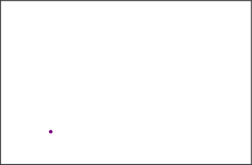
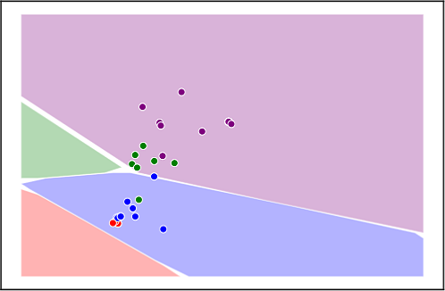
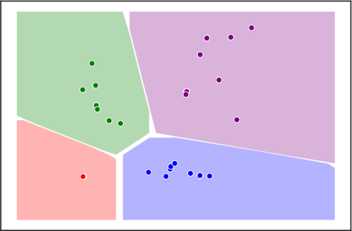

I am a PhD candidate in Information Engineering at University of Siena, advised by [Prof. Marco Maggini](http://sailab.diism.unisi.it/people/marco-maggini/).
I joined the Siena Artificial Intelligence Laboratory [SAILab](https://sailab.diism.unisi.it/), an exciting place to study and deepen my knowledge into Machine Learning.

I am generally interested in Artificial Intelligence and other connected areas of computer science.
My recent contributes are related to both the application of 
Deep Learning models to computer vision and video analysis, and fundational studies regarding novel learning algorithms and neural models.
I am particularly interested in the emerging field of non-euclidean Deep Learning, in particular in Graph Neural Networks.

News
====
- **[September 2020]** My paper "Focus of Attention Improves Information Transfer in Visual Features" accepted at NeurIPS 2020 Conference! Have a look at the technical report [here](https://arxiv.org/abs/2006.09229)

- **[January 2020]** "A Lagrangian Approach to Information Propagation in Graph Neural Networks" accepted at ECAI 2020. You can find more on the [publication](https://mtiezzi.github.io/publications/) section.

Projects
========

I am currently involved in several projects at SAILab

  

Lagrangian Propagation Graph Neural Networks
--------------------------------------------

We propose a novel approach to the state computation and the learning algorithm for GNNs, based on a constraint optimisation task solved in the Lagrangian framework. The state convergence procedure is implicitly expressed by the constraint satisfaction mechanism and does not require a separate iterative phase for each epoch of the learning procedure. 
In fact, the computational structure is based on the search for saddle points of the Lagrangian in the adjoint space composed of weights, neural outputs (node states), and Lagrange multipliers. 
The proposed approach is compared experimentally with other popular models for processing graphs. 
You can find more on the [publication](https://mtiezzi.github.io/publications/) section.

  
   
  

The Graph Neural Network Framework
----------------------------------
You can find more on the [software](https://mtiezzi.github.io/software/) section.

Our research group introduced the Graph Neural Network (GNN), a connectionist model particularly suited for problems whose domain can be represented by a set of patterns and relationships between them.

In those problems, a prediction about a given pattern can be carried out exploiting all the related information, which includes the pattern features, the pattern relationships and, in general, the whole graph that represents the domain. GNN peculiarity consists in its capability of computing the output prediction processing directly the input domain graph, without any preprocessing into a vectorial representation.
GNNs have been proved to be a universal approximator for a class of functions on graphs and have been applied to several tasks, including spam detection, object localization in images, molecule classification.

SAILenv
-------
[SAILenv](http://sailab.diism.unisi.it/sailenv/) is a Virtual Environment powered by Unity3D. It includes 3 pre-built scenes with full pixel-wise annotations. SAILenv is capable of generating frames at real-time speed, complete with pixel-wise annotations, optical flow and depth.

SAILenv also comes with a Python API, designed to easily integrate with the most common learning frameworks available.

  
   
  
  

Learning in Visual Environments
-------------------------------

This [project](http://sailab.diism.unisi.it/lve/) aim at developing intelligent agents with visual skills that operate in a given environment. A continuous stream of data (video signal) is presented to the agent and the agent is expected to learn from the processed information, progressively developing his skills in making predictions over the “pixels” of the observed data stream. While nowadays Computer Vision systems are usually built “offline”, using large-scale and fully-supervised datasets, in this project we consider the most natural setting in which the agent, while “living” in the observed environment, receives a few information (supervisions) from the user, and it also has the capability of asking for supervisions, when needed. The principle of Least Cognitive Action, that parallels the laws of mechanics, is exploited to devise the life-long online learning laws that drive the behaviour of the agent. Motion invariance allows the agent to develop robust features, that is further extended with the idea of invariance to some categories of eye movements, where the notion of focus of attention is introduced to reduce the information overflow that is typical of commonly observed scenes. Human language is processed to create a dialogue-based interaction with the agent.

Education
=========
I received my B.S in Computer and Information Engineering at Siena, with a thesis titled *Automatic Extraction of relevant information from Web Pages, using XPath*.
In 2017 I completed my M.S. in Computer and Automation Engineering at Siena, summa cum laude.
My thesis was titled *Traffic event monitoring using Recurrent Neural Networks*.

Awards
======

:: [1st place Hackathon Soccer Data Challenge](http://sailab.diism.unisi.it/first-place-at-sobigdata-soccer-data-challenge/).
Predicting football players modern roles and analysis of teams’s best schemes using machine learning techniques.

