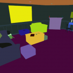
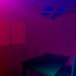

[SAILenv](http://sailab.diism.unisi.it/sailenv) is a Virtual Environment powered by Unity3D. It includes 3 pre-built scenes with full pixel-wise annotations. SAILenv is capable of generating frames at real-time speed, complete with pixel-wise annotations, optical flow and depth.

SAILenv also comes with a Python API, designed to easily integrate with the most common learning frameworks available.

  
   
  
  

The framework
=============

The framework has been developed by [Enrico Meloni](http://sailab.diism.unisi.it/people/enrico-meloni/), [Luca Pasqualini ](http://sailab.diism.unisi.it/people/luca-pasqualini/) and Matteo Tiezzi (me, :), PhD Students at the [SAILab](https://sailab.diism.unisi.it/)  under the supervision of [Stefano Melacci](http://sailab.diism.unisi.it/people/stefano-melacci/).

You can find a description of the framework in the web page [SAILenv](http://sailab.diism.unisi.it/sailenv).
We provide a [github repo](https://github.com/sailab-code/SAILenv) containing our implementation and a [pip package](https://badge.fury.io/py/sailenv) to easily install our software.

